# Conversational Agent Control Surfaces

### A Pattern Language for Mixed-Initiative, Tool-Using Interfaces

---

## Preface: why this form, and why now

The *Design Patterns* catalogue worked because it named things practitioners
were already building badly and inconsistently. Nobody invented the Observer;
Gamma and his co-authors noticed that four codebases had each grown a different
half-solution to the same problem, and gave the shared shape a name so it could
be argued about.

Conversational agent interfaces are at exactly that moment. Claude Code, Cursor's
agent mode, Aider, Pi, Devin, and a dozen internal tools have each independently
grown an approval prompt, a streaming renderer, a tool-activity log, and a way of
saying "are you sure?" — and none of them call these things the same name. The
literature that exists is either *conversation design* (mature, but grown from
voice assistants and customer-service bots) or *agent UX* (current, but a flat
list of tips rather than a structured language).

What is missing is the middle: a vocabulary with enough rigour to design
against, argue with, and refuse.

### The central claim

> **The transcript is not the interface.** In a tool-using agent, conversation is
> the *control and negotiation layer*. Plans, diffs, approvals, tool calls, and
> artifacts are first-class structured objects that the conversation refers to,
> commands, and takes responsibility for.

Every pattern here follows from that. A system that treats the transcript as the
whole interface will reimplement each of these badly, as prose.

### The adapted template

The original template assumed the artifact under discussion was *code*. Here it
is *an exchange*, so two fields change and one is added.

| Gang of Four | Here | Why |
|---|---|---|
| Intent | **Intent** | unchanged |
| Also Known As | **Also Known As** | unchanged — the fragmentation is the problem |
| Motivation | **Motivation** | unchanged: a concrete scenario that hurts |
| Applicability | **Applicability** | unchanged |
| Structure | **Structure** | a diagram of turn and authority flow, not class inheritance |
| Participants | **Participants** | roles in the exchange, not objects |
| Collaborations | **Collaborations** | unchanged |
| Consequences | **Consequences** | unchanged — costs stated, not hidden |
| Implementation | **Implementation** | unchanged |
| Sample Code | **Sample Interaction** | *the artifact is a dialogue* |
| — | **Failure Signature** | *added* |
| Known Uses | **Known Uses** | unchanged |
| Related Patterns | **Related Patterns** | unchanged |

**Failure Signature** is the addition, and it earns its place. A missing design
pattern in code announces itself as duplication you can point at. A missing
conversational pattern announces itself as *a feeling* — the tool is annoying,
the agent is untrustworthy, the thing "doesn't work" — and the diagnosis is
usually wrong. Naming the observable symptom is how the pattern becomes
actionable rather than aesthetic.

### Shared vocabulary

Defined once, used throughout.

| Term | Meaning |
|---|---|
| **Principal** | the human whose authority the agent borrows. Not "the user" — the word carries the delegation |
| **Agent** | the system that plans, decides, and acts |
| **Turn** | the unit of exchange, and the thing that is *held* by exactly one party |
| **Tool** | a capability with effects outside the conversation |
| **Artifact** | a durable output promoted out of the transcript into an inspectable object |
| **Gate** | a point where authority must be re-granted before proceeding |
| **Gauge** | a signal reporting system state to the principal |
| **Transcript** | the ephemeral record of the exchange |
| **Memory** | the durable record that survives the transcript |
| **Blast radius** | the set of things a step can change, weighted by reversibility |

---

## The map

The patterns are not a list; they sit at defined points on the loop that a
delegated task travels. Read the loop first — most arguments about agent design
are really arguments about which arc you are on.

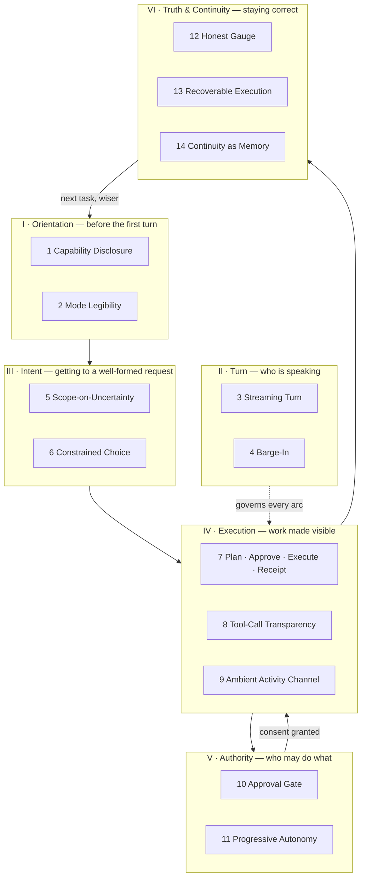

Turn management is drawn to the side deliberately: it is not a stage but a
property of every stage. A system can have an excellent approval gate and still
be intolerable because the principal cannot interrupt it.

---

# I · Orientation

## 1 · Capability Disclosure

**Intent** — Make the agent's powers, position, and limits legible before the
principal commits to a request, so that expectations are formed from evidence
rather than from optimism.

**Also Known As** — Onboarding Surface; Working-Context Banner; "what can you
do?"; Affordance Advertisement.

**Motivation** — A principal opens a terminal agent and types "fix the tests."
The agent can read files, run commands, and edit code — but it is rooted in the
wrong directory, has no network access, and is looking at a different branch than
the principal assumes. Every one of those facts is knowable at startup. None of
them is shown. The failure surfaces ten minutes later as a confusing wrong
answer, and the principal blames the model's intelligence rather than its
position.

Disclosure is not a help screen. A help screen answers *what commands exist*;
disclosure answers *what is true right now* — which repository, which branch,
which model, which permissions, which tools, what it cannot do.

**Applicability** — Use when the agent's effective capability varies by context
(directory, credentials, connected services, mode); when the cost of a wrong
assumption is paid late; or when the same surface is used by principals with
different mental models.

**Structure**

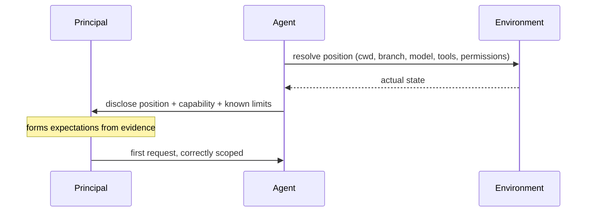

**Participants** — *Agent* resolves and states its own position. *Environment*
supplies ground truth. *Principal* calibrates.

**Collaborations** — Feeds **Mode Legibility** (2), which is disclosure of the
one variable most likely to change under the principal's feet. A weak disclosure
increases the load on **Scope-on-Uncertainty** (5), because the agent must ask
about things it could have simply stated.

**Consequences**
- *Gain*: mis-scoped requests are prevented rather than debugged.
- *Gain*: the principal's model of the agent stays accurate as context changes.
- *Cost*: screen real estate and startup noise. Disclosure that scrolls past
  unread is decoration.
- *Cost*: it must be **derived, never authored**. A hand-written capability list
  is a lie with a delay fuse.

**Implementation** — Derive every disclosed fact from the live system at the
moment of disclosure. Prefer a persistent, low-noise surface (a status line, a
banner that stays) over a one-time splash. Disclose *limits* alongside powers:
"no network" is more useful than the ten tools that are available. When a
disclosed fact changes mid-session, say so — an unannounced change is worse than
never having disclosed it.

**Sample Interaction**

```
organon-one · master · claude-opus-5
tools: read, write, bash, powershell   ·   no network
⚠ this is a git worktree — added directories from the parent session are not inherited

> fix the failing test
```

**Failure Signature** — The principal periodically asks questions whose answers
the system already knows ("are you in the right folder?", "can you see the
database?"). Repeated orientation questions are the tax on absent disclosure.

**Known Uses** — Claude Code's startup banner (cwd, model, git branch). Cursor's
workspace indicator. `git status` — the oldest and still one of the best
capability-disclosure surfaces in software, and worth studying precisely because
it is not conversational.

**Related Patterns** — **Mode Legibility** (2) is its highest-frequency special
case. **Honest Gauge** (12) governs its correctness.

---

## 2 · Mode Legibility

**Intent** — When a surface has modes that change the meaning of the same input,
make the active mode visible *at the moment of use*, not merely settable at the
moment of configuration.

**Also Known As** — Modal Feedback; Mode Indicator; State Visibility.

**Motivation** — A push-to-talk voice surface has two modes: *dictation*, where
speech becomes text at the cursor, and *agent*, where speech goes to an
assistant who answers aloud. The mode is chosen from a menu and persists. A
principal who left it in dictation, then returns expecting conversation, holds
the key, speaks, and gets text pasted into a code fence. Nothing errored.
Everything worked. The system is behaving perfectly and appears broken.

The sharper version, observed directly: the same binary exposes `--tray`
(icon, overlay, push-to-talk) and `--listen` (identical capture loop, no
interface at all). Launched with the wrong flag, the voice loop works flawlessly
and the entire visible interface is simply absent — a failure that reads as
"the UI is broken" and is actually "you asked for the headless mode."

**Applicability** — Use whenever identical input produces materially different
effects depending on state; when a mode persists across sessions; or when a mode
is set in one place and used in another.

**Structure**

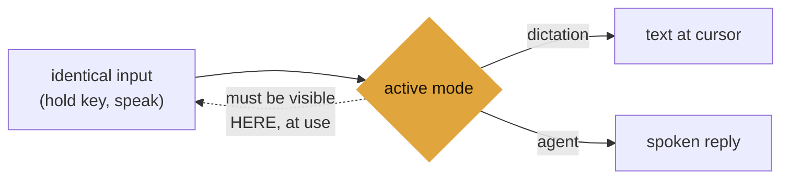

**Participants** — *Mode* is the hidden variable. *Input* is ambiguous without
it. *Indicator* resolves the ambiguity where the input is given.

**Collaborations** — A special case of **Capability Disclosure** (1) with a much
higher refresh rate. Where modes carry different blast radii, **Approval Gate**
(10) should key off the mode, not merely the action.

**Consequences**
- *Gain*: the class of bug where "it works but appears broken" disappears.
- *Cost*: an indicator at the point of use competes for the most valuable space
  on the surface.
- *Trap*: an indicator that is technically present but distant from the point of
  use (a tray tooltip, a menu checkmark) does not satisfy the pattern. The test
  is whether the principal sees it *while acting*, not whether it exists.

**Implementation** — Bind the indicator to the same state the behaviour reads
from, never to a parallel copy. Prefer encoding mode in a channel the principal
is already attending to — the cursor, the prompt, the colour of the thing they
are holding. Where a mode has a default at startup that differs from the last
used mode, say so at startup, loudly; silently reverting to a default is the
most common instance of this failure.

**Sample Interaction**

```
◉ AGENT   hold Ctrl+Win, speak — she answers aloud
○ dictate hold Ctrl+Win, speak — text lands at your cursor
          ^ tray menu · current mode also shown in the overlay while you hold
```

**Failure Signature** — "It stopped working" for a system that is fully
operational. Reports that cannot be reproduced by the maintainer, because the
maintainer's mode differs.

**Known Uses** — vim's `-- INSERT --`. Caps-lock indicators. Cursor's agent/ask
toggle. Terminal agents that print the active model in the prompt.

**Related Patterns** — **Capability Disclosure** (1), **Honest Gauge** (12).

---

# II · Turn

## 3 · Streaming Turn

**Intent** — Emit the response as it is produced rather than when it is complete,
so that the principal's wait overlaps the agent's work instead of following it.

**Also Known As** — Incremental Rendering; Token Streaming; Progressive
Response.

**Motivation** — A voice agent's reply took 11.8 seconds from the end of the
principal's speech to the first spoken word. Decomposed: roughly 7 seconds of
model generation, then roughly 4.9 seconds of speech synthesis — strictly in
series, because the synthesiser was handed the reply only when the reply was
finished. Neither component was slow for what it did. The architecture simply
declined to overlap them.

The fix is not optimisation. It is refusing to treat "the response" as an atomic
object. Once the response is a *stream of complete-enough fragments*, synthesis
of sentence one proceeds while sentence two is still being written. Measured on
the same system after the change: the first speakable sentence was available at
**+1.14 s** where the previous path returned nothing at all until **+3.94 s**.

**Applicability** — Use when generation is incremental and a downstream stage
(rendering, synthesis, compilation, display) can begin on a prefix; when
perceived latency matters more than total latency; when the response may be long.

Do **not** use when the consumer cannot act on a prefix without risk of acting on
a fragment that the remainder contradicts.

**Structure**

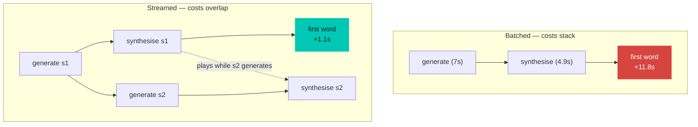

**Participants** — *Producer* emits fragments. *Splitter* decides what
constitutes a complete-enough fragment. *Consumer* acts on each fragment in
order.

**Collaborations** — Makes **Barge-In** (4) meaningful: there is nothing to
interrupt until something has started. Interacts with **Tool-Call Transparency**
(7); tool events belong in the same stream, in order.

**Consequences**
- *Gain*: perceived latency collapses toward the cost of the first fragment.
- *Gain*: the principal can begin evaluating — and interrupting — early.
- *Cost*: fragment boundaries become a design surface with their own failure
  modes. Fragments too small starve the consumer; too large reintroduce the
  original stall.
- *Cost*: partial output may be contradicted by what follows. Streaming a
  half-written code fence or a negation that has not arrived yet is worse than
  waiting.
- *Trap*: **the invariant to protect is that streaming changes only *when* the
  content appears, never *what* it is.** This is testable and should be tested:
  the concatenation of streamed fragments must equal the batched output, across
  arbitrary delta boundaries down to one character.

**Implementation** — Keep fragmentation policy at the *consumer*, which alone
knows its own costs; a producer that guesses at chunk sizes will drift from the
consumer that measures them. Negotiate streaming explicitly (a header, a
capability flag) so that a non-streaming consumer still works and so the whole
change can be reverted without a rebuild. Hold fragments back across
structures that are meaningless in half — code fences, quotations, negations.

**Sample Interaction**

```
[+0.28s] {"type":"transcript","text":"On Friday confession will be heard...","stt_ms":260}
[+0.59s] {"type":"delta","text":"Yes, that's the swap unit."}
[+1.29s] {"type":"delta","text":" It was reporting failed while swap was active,"}
[+1.99s] {"type":"tool","on":true,"name":"bash"}
[+2.69s] {"type":"delta","text":" which is worse than cosmetic."}
[+3.39s] {"type":"end","reply":"Yes, that's the swap unit. It was ..."}
```

**Failure Signature** — A progress spinner with no content behind it. A response
that arrives all at once after a long pause, where the length of the pause
correlates with the length of the answer — the signature that the system is
paying for its own verbosity before showing any of it.

**Known Uses** — ChatGPT and Claude token streaming. Compiler diagnostics
emitted per-file. `git clone` progress. The `speak-replies` sentence pipeline in
Pi, which streams to a synthesiser rather than a screen.

**Related Patterns** — **Barge-In** (4), **Tool-Call Transparency** (8).

---

## 4 · Barge-In

**Intent** — Let the principal seize the turn at any moment, and define
precisely — and honestly — what that stops.

**Also Known As** — Interrupt; Cancel; Stop Generation; Push-to-Talk Override.

**Motivation** — The agent is thirty seconds into explaining something the
principal already understood at second three. Without interruption, the only
options are to wait or to kill the session, and both teach the principal to ask
smaller questions than they actually have. Interruption is not a convenience
feature; it is what makes it safe to let the agent try.

But interruption has a *scope*, and the scope is usually misrepresented.
Stopping audio is not stopping thought. Stopping the display is not stopping the
tool call that is already writing to disk. A system that says "stopped" while a
turn continues in the background has lied about the one thing the principal was
trying to control.

**Applicability** — Use in any surface with long-running output. Essential where
output is time-based (speech, animation) and the principal cannot skim ahead.

**Structure**

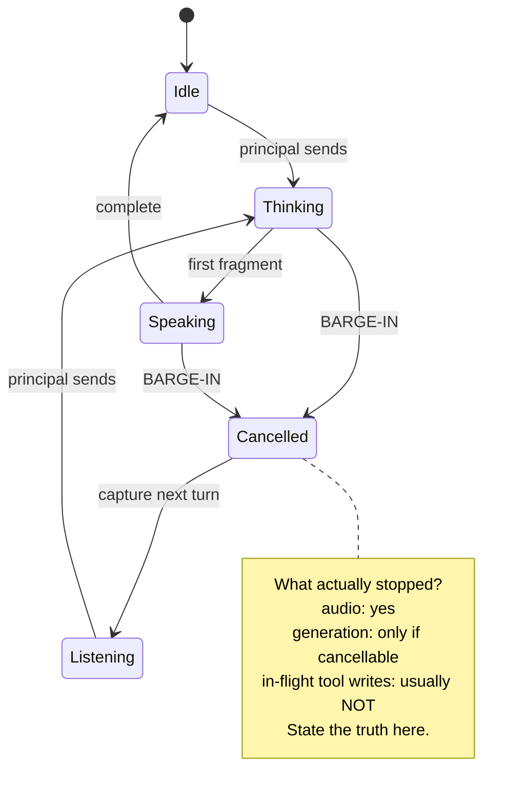

**Participants** — *Principal* seizes. *Turn* is relinquished. *Cancellation
scope* is the contract about what ceased.

**Collaborations** — Depends on **Streaming Turn** (3). Constrains **Recoverable
Execution** (13): whatever cannot be stopped must be undoable.

**Consequences**
- *Gain*: the principal can let the agent attempt more, because attempts are
  cheap to abandon.
- *Gain*: one motion — interrupt and redirect — is far better than stop, wait,
  retype.
- *Cost*: cancellation must thread through every layer, including ones that do
  not naturally support it.
- *Trap*: partially-completed side effects. An interrupted turn that wrote three
  of five files has left the world in a state no one designed.
- *Trap*: **cleanup that waits for the thing you cancelled.** Observed directly,
  and worth the warning because it was introduced by a *latency improvement*.
  Adding **Streaming Turn** (3) moved generation to run concurrently with
  playback; the code after playback then joined the reader thread — which was
  still draining the reply. So the interrupt stopped the audio and immediately
  blocked the microphone until the agent finished thinking, destroying the
  "cut her off and talk" property the interrupt existed to provide. The
  pre-streaming version could not have had this bug, because the turn was
  already complete before anything was spoken. **Every assumption of the form
  "the turn is over by now" downstream of a pipeline becomes false the moment
  that pipeline starts overlapping stages.**

**Implementation** — Make the interrupt the same gesture as the next request
where possible; a single motion beats two. Check cancellation at every stage
boundary, and drop queued work rather than merely hiding it — generating speech
nobody will hear wastes the resource that made the system fast. State the scope
of cancellation in the interface, in the principal's language: *"audio stopped;
she is still finishing the turn."*

**Sample Interaction**

```
← Vera: The swap unit was reporting failed while swap was actually active,
        which is worse than cosmetic because —
[principal holds the key]
  ⏹ audio stopped (18 ms) · turn still completing in background
◉ listening…
```

**Failure Signature** — Principals wait out responses they have stopped reading.
Or: they kill and restart the process to regain control — the strongest possible
signal that interruption is absent or untrusted.

**Known Uses** — ChatGPT's stop button. Claude Code's Esc. Voice assistants'
wake-word barge-in. The `cancelled()` predicate threaded through a synthesis
pipeline, checked at every chunk boundary.

**Related Patterns** — **Streaming Turn** (3), **Recoverable Execution** (13).

---

# III · Intent

## 5 · Scope-on-Uncertainty

**Intent** — Ask exactly one high-value question when ambiguity would change the
blast radius; otherwise proceed on a stated assumption.

**Also Known As** — Clarifying Question; Disambiguation Turn; "scope services
when in doubt."

**Motivation** — Two failure modes bracket this pattern, and most systems pick
one and suffer it. The over-asking agent confirms everything, and the principal
learns to skim and approve blindly — which destroys the value of the questions
that mattered. The under-asking agent guesses silently, and is right often
enough that the one time it deletes the wrong branch is a genuine shock.

The resolution is not "ask when uncertain." It is **ask when uncertainty changes
what can be damaged.** Ambiguity about formatting is not ambiguity about which
database.

**Applicability** — Use when multiple readings of a request lead to materially
different work; when the cheap reading is reversible and the expensive one is
not; when a read-only inspection could resolve the ambiguity without asking at
all.

**Structure**

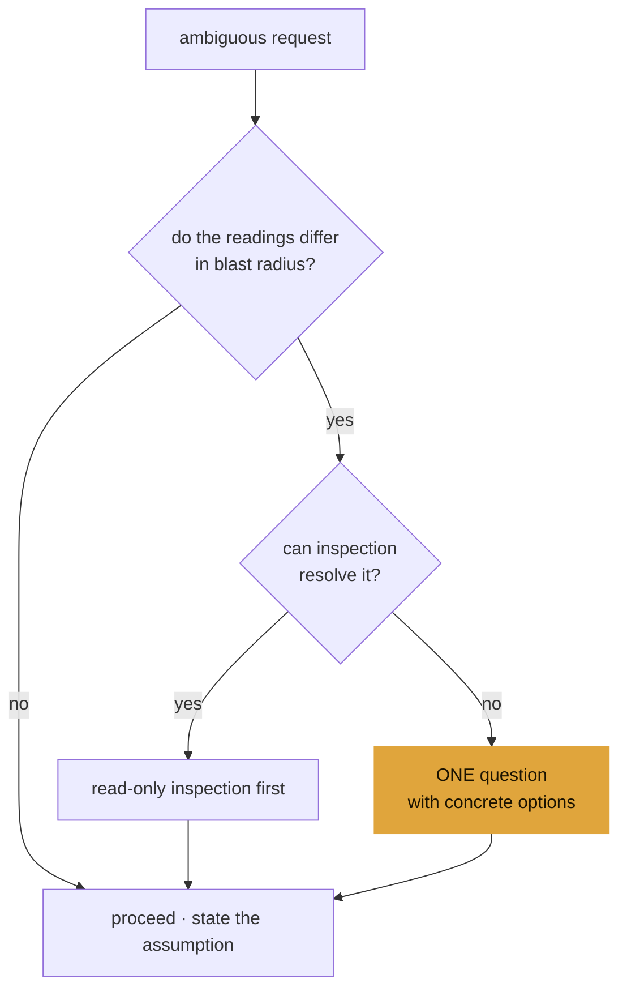

**Participants** — *Request* carries the ambiguity. *Blast-radius estimate* is
the decision function. *Inspection* is the preferred resolution. *Question* is
the fallback.

**Collaborations** — Where the answer determines authority rather than
direction, escalate to **Approval Gate** (10). The options offered should follow
**Constrained Choice** (6).

**Consequences**
- *Gain*: questions become rare and therefore heeded.
- *Gain*: the principal's attention is spent on decisions only they can make.
- *Cost*: requires a blast-radius model, which is real engineering, not a prompt.
- *Trap*: asking a question whose answer the agent could have discovered by
  looking. That is not caution; it is delegation back to the principal.

**Implementation** — Prefer inspection to interrogation: a read-only probe that
resolves the ambiguity costs the principal nothing. When you must ask, ask once,
with concrete alternatives and a recommendation. Do everything that does *not*
depend on the answer first, so the question arrives alongside progress rather
than instead of it. Reserve blocking questions — stopping with nothing delivered
— for cases where proceeding under any assumption would be unsafe or would waste
the work.

**Sample Interaction**

```
> deploy the new build

Two readings, and they differ in what they touch:
  · staging   — reversible, no customer traffic
  · production — irreversible for ~4 min, customer-visible

I've built and tested the artifact (that part is common to both).
Which target?
```

**Failure Signature** — Confirmation fatigue: the principal answers "yes" without
reading. Or its opposite: a class of incident whose post-mortem always begins
"it assumed I meant…".

**Known Uses** — Microsoft's HAI Guideline 8, "scope services when in doubt."
`rm -i`. Package managers that show a plan before resolving.

**Related Patterns** — **Constrained Choice** (6), **Approval Gate** (10).

---

## 6 · Constrained Choice

**Intent** — When ambiguity is enumerable, offer the options as selectable
structure rather than inviting free text.

**Also Known As** — Quick Replies; Suggestion Chips; Numbered Options; Slot
Filling.

**Motivation** — "How would you like me to handle the migration?" is a question
that costs the principal a paragraph to answer and the agent another turn to
interpret. If there are three viable approaches, saying so — and letting one be
chosen — converts an essay into a keystroke and removes the interpretation step
entirely.

This is the point where conversational purism does damage. Natural language is
the right input for *expressing intent*; it is a poor input for *selecting among
known alternatives*. Modern practice is explicitly hybrid: blend free text with
structured controls rather than forcing everything through prose.

**Applicability** — Use when the option set is known, small (two to five), and
mutually exclusive or clearly multi-select. Do not use when the option set is
long, when the principal's own framing carries information you would discard, or
when offering options would prematurely narrow a genuinely open question.

**Participants** — *Option set* is finite and enumerated. *Recommendation*
carries the agent's judgement. *Escape hatch* preserves free text for the case
you did not anticipate.

**Collaborations** — Supplies the presentation layer for **Scope-on-Uncertainty**
(5) and **Approval Gate** (10).

**Consequences**
- *Gain*: the principal's cost of answering drops to near zero.
- *Gain*: the agent receives an unambiguous token rather than prose to parse.
- *Cost*: enumerating options is a commitment; a missing option is now the
  agent's fault rather than the principal's oversight.
- *Trap*: options that are not really distinct. Three phrasings of the same
  action read as a system pretending to consult.

**Implementation** — Always include an escape to free text; the enumerated set is
a shortcut, not a cage. Order options by recommendation and say which is
recommended and why. Make the *consequences* of each option visible in the
option itself, not in prose above it — the principal chooses from the list, and
whatever is not in the list is not read.

**Sample Interaction**

```
Where should this start?

  1  Streaming the reply  (recommended) — biggest measured win, ~11.8s → ~3s
  2  Verify the chord first — 30 seconds of your time, gates everything else
  3  The small true things — four closures, all reversible
  4  Tier 4 lighting — self-contained, visible immediately

  …or tell me something else.
```

**Failure Signature** — Long principal replies that are mostly re-stating options
the agent already had. Repeated clarification loops on the same axis.

**Known Uses** — Slack's interactive message buttons. Claude Code's permission
prompt (allow once / allow always / deny). `git rebase -i`'s verb list.

**Related Patterns** — **Scope-on-Uncertainty** (5), **Approval Gate** (10).

---

# IV · Execution

## 7 · Plan · Approve · Execute · Receipt

**Intent** — Structure delegated work as four distinct phases so that
understanding, consent, action, and evidence are each separately inspectable.

**Also Known As** — Propose-Confirm-Act; Dry-Run-Then-Apply; The Agent Loop.

**Motivation** — The two degenerate forms are familiar. An agent that acts
immediately produces work the principal must audit after the fact, when the cost
of being wrong has already been paid. An agent that only proposes produces
documents the principal must execute themselves, which is most of the work.

The pattern's real content is *where the seam goes*. Approval placed after
planning but before execution is the only position where the principal's
judgement is both informed and still useful. Approval sought before a plan
exists asks the principal to consent to an unknown; approval sought after
execution is not approval.

The fourth phase is the one most often dropped. A receipt — what actually
happened, as distinct from what was planned — is what makes the next turn honest.

**Applicability** — Use for any multi-step task with side effects. Scale the
ceremony to the blast radius: a reversible one-step change does not need a plan
document, and the pattern degrades gracefully to "act, then receipt."

**Structure**

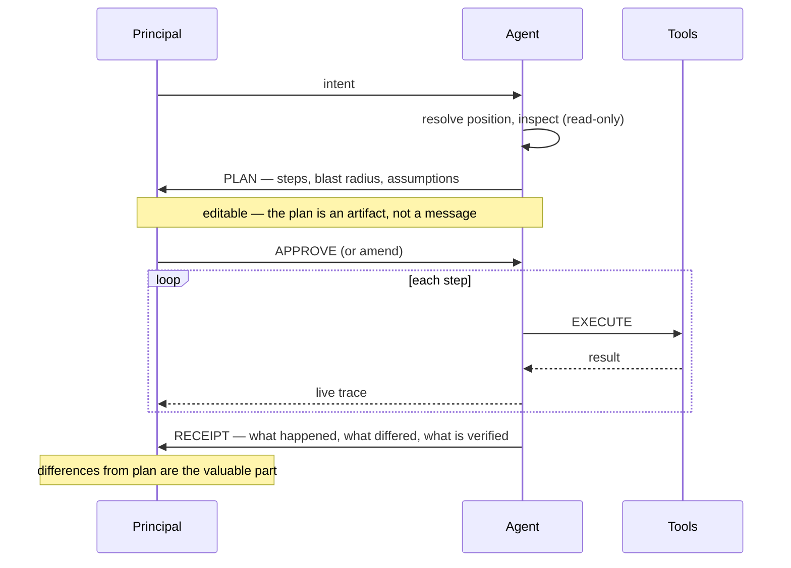

**Participants** — *Plan* is an editable artifact. *Gate* is the consent
boundary. *Trace* is live evidence. *Receipt* is durable evidence.

**Collaborations** — The gate is **Approval Gate** (10), placed by
**Progressive Autonomy** (11). The trace is **Tool-Call Transparency** (8). The
receipt feeds **Continuity as Memory** (14).

**Consequences**
- *Gain*: the principal's review happens when it can still change the outcome.
- *Gain*: plans are reusable, quotable, and correctable artifacts.
- *Cost*: four phases on trivial work is bureaucracy that trains people to skip
  the phases on non-trivial work.
- *Trap*: a receipt that restates the plan rather than reporting reality. If the
  receipt cannot differ from the plan, it is not a receipt.

**Implementation** — Make the plan editable in place rather than something to be
rejected and regenerated. Report divergence loudly: the steps that did *not* go
as planned are the receipt's entire value. Never mark a step complete on the
basis of having started it — record the artifact, not the intent.

**Sample Interaction**

```
PLAN
  1  commit 13 files to the working branch
  2  merge to master (branched off master — not stacked)
  3  rebuild in the main checkout            ← durable path, not the worktree
  4  re-point the login shim                 ← standing change, survives reboot
  5  mirror the change log
  none of these need elevation.

> go

RECEIPT
  ✓ 1  b9574b2 · 13 files, +1036 −135
  ✓ 2  870e197 · merged, pushed to origin
  ✓ 3  rebuilt · warnings only · Ctrl+Win confirmed in the binary
  ✓ 4  shim now points at the main checkout
  ✓ 5  mirrored — line-ending-only diff discarded
  ⚠ noted: .claude/ left untracked — your call, not mine
```

**Failure Signature** — The principal reads diffs after the fact to discover what
was done. "What did you change?" asked *after* an agent turn is the diagnostic.

**Known Uses** — Terraform's `plan` / `apply`. Claude Code's plan mode. Aider's
diff-then-commit. `apt`'s package plan.

**Related Patterns** — **Approval Gate** (10), **Tool-Call Transparency** (8),
**Recoverable Execution** (13).

---

## 8 · Tool-Call Transparency

**Intent** — Expose which tool ran, against what target, why, and with what
result — as structured events, not as prose and not as raw reasoning.

**Also Known As** — Activity Trace; Tool Receipt; Action Log.

**Motivation** — An agent that says "I checked the configuration" has told the
principal nothing checkable. An agent that shows `grep -n "8767" services/lighting/src/main.rs`
and its output has told them something they can verify, correct, and reuse. The
difference is not verbosity; it is whether the claim is *anchored*.

The boundary matters in both directions. Exposing the tool call is necessary.
Exposing raw chain-of-thought is neither necessary nor generally desirable — it
is long, it is not a commitment, and treating it as one trains principals to
audit the wrong artifact. What the principal needs is the *action*, its *target*,
and its *result*.

**Applicability** — Use whenever a tool has effects outside the conversation, or
whenever a claim in the response depends on something the agent observed.

**Structure**

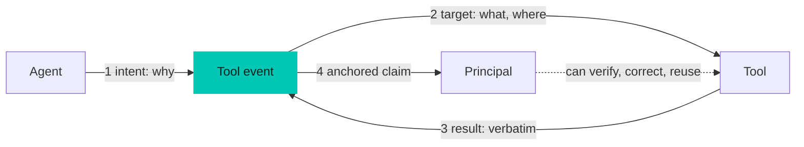

**Participants** — *Tool event* carries intent, target, and result as structure.
*Claim* in the prose references the event.

**Collaborations** — Rides the same channel as **Streaming Turn** (3), in order.
Feeds **Ambient Activity Channel** (9) and **Recoverable Execution** (13).

**Consequences**
- *Gain*: claims become verifiable, and errors become locatable.
- *Gain*: the principal learns the system's actual competence, rather than
  guessing at it.
- *Cost*: volume. An agent that runs forty tools produces forty events, and an
  undifferentiated wall of them is its own opacity.
- *Trap*: showing the call but not the result, which is the appearance of
  transparency without the substance.

**Implementation** — Emit tool activity as *typed events in the response stream*,
not as text the model composed — a model describing its own tool use can be
wrong about it. Collapse routine reads by default; expose writes always. Make
targets clickable or addressable (`file:line`) so the trace is a navigation
surface, not just a record.

**Sample Interaction**

```
⏺ Bash · why: confirm the renderer's bind address
  grep -rn "bind\|8767" services/lighting/src/main.rs
  → main.rs:508  UdpSocket::bind(SocketAddr::from(([127,0,0,1], port)))

  Loopback only — so WSL cannot reach it. That rules out the direct route.
```

**Failure Signature** — The principal cannot tell whether the agent actually
looked, or is recalling. Claims that turn out to be plausible reconstructions of
files never read.

**Known Uses** — Claude Code's tool-call cards. Cursor's file-edit list. Devin's
terminal pane. CI logs as the pre-agent ancestor of the whole pattern.

**Related Patterns** — **Ambient Activity Channel** (9), **Honest Gauge**
(12).

---

## 9 · Ambient Activity Channel

**Intent** — Signal the agent's state through a channel the principal perceives
without attending to it, so that presence and progress cost no screen and no
focus.

**Also Known As** — Peripheral Awareness; Presence Layer; Calm Signalling.

**Motivation** — A principal who delegates a two-minute task does one of two
things: watches the transcript, which wastes the delegation, or leaves, which
means discovering the outcome late. Both are bad, and the on-screen middle
ground — spinners, progress bars — still demands the eye.

Peripheral channels solve this. A lamp on the desk that reads violet while the
agent thinks, cyan while it runs a tool, warm while it speaks, and amber while it
waits for consent conveys state continuously to someone who is looking at
something else entirely. It costs no pixels, competes with no content, and is
legible from across a room.

The distinction that makes this a pattern rather than a gimmick: **the channel
reports state, never instructions.** The renderer is told *what is happening*
("a tool is running") and decides *what that looks like*. Semantics and
presentation stay separable, so the palette can be retuned without touching the
agent.

**Applicability** — Use when tasks are long enough to walk away from; when the
principal's attention is genuinely elsewhere; when a physical or peripheral
channel exists. Especially valuable where the agent has no visible surface at all
— a headless or voice-first system.

**Structure**

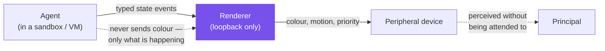

**Participants** — *State events* are semantic. *Renderer* owns presentation and
a priority stack. *Device* is peripheral. *Principal* perceives without
attending.

**Collaborations** — Consumes **Tool-Call Transparency** (8) events. Must obey
**Honest Gauge** (12) — a peripheral signal that lies is worse than a
transcript that lies, because it is trusted without being read.

**Consequences**
- *Gain*: presence with zero attentional cost, and zero screen cost.
- *Gain*: states that are otherwise invisible (a tool-heavy turn returning no
  text) become legible.
- *Cost*: a second rendering surface to keep true, on a channel with no error
  reporting.
- *Cost*: ambiguity. A small alphabet of states must be distinguishable at a
  glance; more than about six is a colour-memory quiz.
- *Trap*: network topology. A sandboxed or virtualised agent frequently *cannot*
  reach a loopback-bound renderer on the host. Relaying state through a channel
  that is already open beats opening the renderer to the network.

**Implementation** — Send state, not presentation. Give every state a
time-to-live so a lost "off" event decays rather than stranding the device.
Establish a priority order — a failure should interrupt a completion flourish,
not queue behind it. Make the whole channel opt-in and fire-and-forget: a lamp
must never block the path that captures audio or applies a patch.

**Sample Interaction**

```
{"t":"listening","on":true}                  → teal, rising
{"t":"thinking","on":true}                   → violet, slow drift (never repeats)
{"t":"tool","on":true,"name":"bash"}         → cyan, crisper scan
{"t":"speaking","on":true,"ms":4200}         → warm white, speech cadence
{"t":"error","msg":"agent unreachable"}      → red, brief, then decays
```

**Failure Signature** — The principal watches a transcript for a task they had
delegated. Or, revealingly, they ask "is it still going?" — the question a
peripheral channel exists to make unnecessary.

**Known Uses** — Build-status lamps and CI orbs. IDE gutter activity indicators.
Terminal bell on completion. Govee lamps driven from a voice agent's turn
lifecycle, as described above.

**Related Patterns** — **Tool-Call Transparency** (8), **Honest Gauge**
(12), **Mode Legibility** (2).

---

# V · Authority

## 10 · Approval Gate

**Intent** — Require explicit, per-action consent before any step that is
irreversible, outward-facing, or spends the principal's authority in a way they
would want to know about.

**Also Known As** — Confirmation; Permission Prompt; Human-in-the-Loop
Checkpoint.

**Motivation** — Delegation is not transfer. A principal who says "clean up the
old branches" has delegated judgement about *which* branches, not authority to
push a force-delete to a shared remote. The gap between those is where every
agent horror story lives.

The design difficulty is that gates are expensive: each one costs attention, and
attention spent on a low-stakes gate is unavailable for a high-stakes one. A
system that confirms everything has, in practice, confirmed nothing.

The organising principle is **reversibility, not danger**. A frightening-sounding
but trivially revertible action needs no gate. A boring-sounding one that sends
mail to a customer needs one, every time.

**Applicability** — Gate: irreversible deletion, outward-facing communication,
spending money, publishing, granting access, changing standing configuration that
outlives the session. Do not gate: reads, reversible local edits under version
control, anything already covered by a broader consent the principal gave
knowingly.

**Structure**

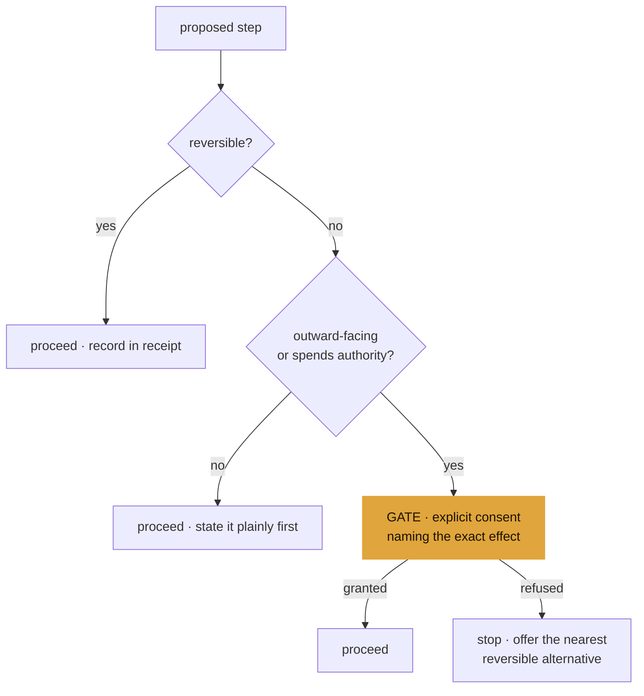

**Participants** — *Blast-radius test* decides. *Gate* names the specific effect.
*Consent* is per-action and does not generalise.

**Collaborations** — Positioned by **Progressive Autonomy** (11), presented via
**Constrained Choice** (6), and made cheaper by **Recoverable Execution** (13):
the more that is undoable, the fewer gates are needed.

**Consequences**
- *Gain*: the principal retains authority over exactly the actions that carry it.
- *Gain*: gates are rare enough to be read.
- *Cost*: latency at precisely the moments the principal is least present.
- *Trap*: **consent laundering.** Approval obtained once, in one context, silently
  reused in another. Consent is per-action and per-session unless the principal
  said otherwise in terms they would recognise.
- *Trap*: a gate that cannot be satisfied. If the agent lacks the capability
  anyway, asking is theatre — say what the principal must do themselves.

**Implementation** — Name the specific effect, not the category: *"push to
`origin/master`, force"* rather than *"perform a git operation."* Where the agent
genuinely cannot act — an unelevated shell facing a root-owned unit — do not
route around it; say plainly that a prompt is coming, what it is for, and hand
over the exact command. Make refusal cheap and non-punitive: offer the nearest
reversible thing rather than stopping dead.

**Sample Interaction**

```
This one needs your password — sudo is not passwordless here, and a capability
must never sit on a hidden prompt.

    sudo systemctl restart organon-vera

It reloads the rewritten extension. Her memory carries; only live context is
lost. I'll wait — nothing else I'm doing depends on it.
```

**Failure Signature** — Principals discovering completed actions they would have
declined. Or the inverse: a confirm dialog answered reflexively, which means the
gate has become furniture.

**Known Uses** — Claude Code's permission modes. `sudo`. OAuth consent screens.
Deployment approval steps in CI. `git push --force-with-lease` as a gate encoded
in a flag.

**Related Patterns** — **Progressive Autonomy** (11), **Scope-on-Uncertainty**
(5), **Recoverable Execution** (13).

---

## 11 · Progressive Autonomy

**Intent** — Let the scope of unattended action widen with demonstrated
reliability and narrow with risk, rather than fixing it once at design time.

**Also Known As** — Autonomy Budget; Trust Ladder; Supervised → Autonomous.

**Motivation** — A single autonomy setting is wrong in both directions. Set
conservatively, the agent asks permission to read a file for the thousandth time.
Set permissively, it inherits authority over actions the principal never
considered.

Autonomy is better modelled as a *ladder* whose rungs are defined by
reversibility, and on which position is negotiated: the principal grants a rung
for a session, a repository, or a class of action, and the agent falls back a
rung when it encounters something it did not anticipate.

**Applicability** — Use where the same agent performs work spanning several
orders of blast radius; where a long session would otherwise accumulate identical
prompts; where different contexts (a scratch repo, production) warrant different
defaults.

**Structure**

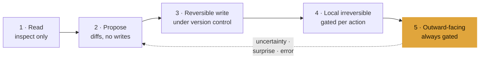

**Participants** — *Rungs* defined by reversibility. *Grant* has scope and
expiry. *Fallback* is automatic on surprise.

**Collaborations** — Determines where **Approval Gate** (10) sits. Depends on
**Recoverable Execution** (13) to make middle rungs safe.

**Consequences**
- *Gain*: prompt volume falls without authority quietly expanding.
- *Gain*: the same agent is usable in a scratch repo and against production.
- *Cost*: a rung model must be explicit and legible, or it becomes an invisible
  policy the principal cannot reason about.
- *Trap*: ratchets. Autonomy that only ever increases is a slow-motion incident;
  descent on surprise is what makes ascent safe.

**Implementation** — Define rungs by reversibility, never by tool name — the same
tool spans several rungs depending on target. Scope grants explicitly (this
session, this repo, this class) and show the current rung as part of
**Capability Disclosure** (1). Fall back automatically when something
unanticipated appears, and say that you did.

**Sample Interaction**

```
Working at rung 3 — reversible writes, this repo, this session.

  ⚠ dropping to rung 2: the change touches the login shim, which outlives
    the session. Standing configuration is a gate, not a write.

  Here is the diff. Say go and I'll apply it.
```

**Failure Signature** — Long sessions accumulating identical approvals. Or an
agent whose permissions, once granted, are never revisited even as the work moves
from a sandbox to something real.

**Known Uses** — Claude Code's plan mode → accept-edits → bypass ladder.
`sudoers` scoping. CI environments with per-branch deploy rights.

**Related Patterns** — **Approval Gate** (10), **Capability Disclosure** (1).

---

# VI · Truth and Continuity

## 12 · Honest Gauge

**Intent** — Ensure that every status signal is wrong *only* when the system is
wrong; a signal that reports failure in its healthy steady state destroys the
value of the signal on the day it is right.

**Also Known As** — Alarm Fatigue Avoidance; Signal Integrity; Meaningful Red.

**Motivation** — A `oneshot` service activates a swapfile at boot. Its
`ExecStart` ran a bare `swapon`, which exits `255` with *"Device or resource
busy"* when the swapfile is already active. So the unit recorded a failure for a
job that had nothing left to do, and the machine's status surface reported
`organon-swap: failed` while 27 GB of swap was demonstrably working.

The cost is not cosmetic. That red is indistinguishable from the red that means
*swap genuinely failed to activate* — the exact condition the unit exists to
prevent, and whose real symptom (a 21 GB model load killed by the OOM reaper) is
expensive to diagnose from the other end. **A gauge that always reads red
tells you nothing on the day it is right.**

The same session produced the pattern's other half: a command surface built
specifically to make traps visible was itself blind to the newest service,
because the service was added and the surface was never told. A gauge can
lie by commission or by omission.

A third instance, found the next day by applying this very checklist, shows the
failure needs no clever cause at all. A lighting service printed
`ambient is OFF` at startup — *two lines above where it parsed the `--ambient`
flag.* It had been running as `glow` and reporting `off` since the flag
shipped. No race, no edge case, no subtle exit code: simply a status line
positioned where it could not disagree with the value it described. **If a
gauge cannot be wrong, it is not reporting anything.**

**Applicability** — Use for every status surface: service states, health checks,
test suites, dashboards, and especially peripheral channels
(**Ambient Activity Channel**, 9) that are trusted without being read.

**Structure**

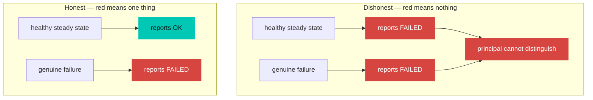

**Participants** — *Gauge* reports. *Healthy steady state* must map to OK.
*Principal* must be able to act on the difference.

**Collaborations** — Governs **Capability Disclosure** (1), **Mode Legibility**
(2), and **Ambient Activity Channel** (9). Undermines **Approval Gate** (10) when
violated: a gate whose stated effect is drawn from a lying gauge obtains
uninformed consent.

**Consequences**
- *Gain*: a signal that is acted upon.
- *Cost*: idempotency is real work. "Already done" must be a success, and
  distinguishing it from "could not be done" often requires a check the naive
  command does not perform.
- *Trap*: gauges that are never re-examined after the system around them
  changes. Most dishonest gauges were honest when written.

**Implementation** — Make the healthy steady state exit zero, explicitly:
guard the action rather than assuming a fresh system. Prefer a check-then-act
that reports "already active" over a bare command whose failure mode overlaps the
condition you are monitoring. Treat *adding a component without teaching the
status surface about it* as an incomplete change — the surface is part of the
component. Re-verify gauges whenever the thing they measure changes shape.

**Sample Interaction**

```
# Before — red in its healthy state
ExecStart=/sbin/swapon /swapfile
  → swapon: /swapfile: swapon failed: Device or resource busy
  → status=255/EXCEPTION · unit: failed        (swap: 27 GB active)

# After — red means red
ExecStart=/bin/sh -c 'if swapon --show=NAME --noheadings | grep -qx /swapfile; \
                      then echo "/swapfile already active"; \
                      else exec swapon /swapfile; fi'
  → /swapfile already active
  → Finished · unit: active                    (swap: 27 GB active)
```

**Failure Signature** — A known-bad indicator that everyone has learned to
ignore. The sentence *"oh, that's always red"* is the pattern's absence, stated
aloud.

**Known Uses** — Idempotent health checks. Configuration management's
converge-to-desired-state model. Flaky-test quarantine, which exists precisely
because a test suite that is always red is not a test suite.

**Related Patterns** — **Capability Disclosure** (1), **Ambient Activity
Channel** (9).

---

## 13 · Recoverable Execution

**Intent** — Ensure every action the agent takes has a visible before-state and a
path back, so that being wrong is cheap.

**Also Known As** — Undo; Checkpoint; Diff-Before-Apply; Rollback.

**Motivation** — Recoverability is what makes every other pattern affordable.
**Approval Gate** (10) can be rare only because ungated actions are reversible.
**Progressive Autonomy** (11) can climb only because the middle rungs are safe.
**Barge-In** (4) is only truly safe when a half-finished turn can be unwound.

The corollary is the design rule: *the amount of ceremony an action needs is
inversely proportional to how easily it can be undone.* Invest in reversibility
and you buy down the interaction cost of everything else.

**Applicability** — Use for all state-changing work. Especially valuable where
the agent operates faster than the principal can review, which is the normal
case.

**Structure**

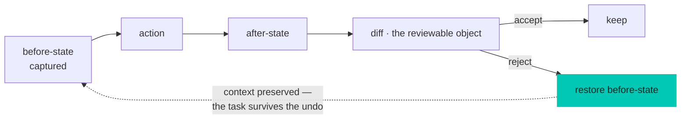

**Participants** — *Before-state* is captured before acting, not reconstructed
after. *Diff* is the reviewable artifact. *Restore* returns without losing the
task.

**Collaborations** — Reduces the number of gates **Approval Gate** (10) needs.
Enables **Progressive Autonomy** (11). Its evidence is **Tool-Call
Transparency** (8).

**Consequences**
- *Gain*: exploration becomes cheap, which is the point of delegation.
- *Gain*: review shifts from prose to diffs — precise, and skimmable.
- *Cost*: capturing before-state has real overhead in time and storage.
- *Trap*: the irreducible set. Sent mail, published posts, deleted remote
  branches, spent money. These cannot be made reversible, which is exactly why
  they are the ones that must be gated.
- *Trap*: undo that discards the *task* along with the change, forcing the
  principal to re-explain. Recovery must preserve context.

**Implementation** — Prefer the substrate's own mechanisms — version control,
transactions, filesystem snapshots — over bespoke undo stacks. Capture
before-state at the boundary of the action, not the boundary of the session.
Make the diff the primary review surface. For genuinely irreversible steps, be
explicit that this is the moment recoverability ends; that is what elevates them
to gates.

**Sample Interaction**

```
Applied to 3 files · nothing committed yet

  chord.rs      +18 −6      default chord → Ctrl+Win
  main.rs       +4  −2      derive the label instead of hardcoding it
  GUIDE.md      +9  −6      the docs said Alt+Win; they were stale

  [d] review diff   [k] keep   [u] undo all   [c] commit
```

**Failure Signature** — Principals copying files aside before letting the agent
work. Manual backups are the tax on absent recoverability, and a precise measure
of how much the agent is trusted.

**Known Uses** — Git as the universal substrate. Cursor's checkpoint-and-restore.
Aider's per-change commits. Database transactions.

**Related Patterns** — **Approval Gate** (10), **Progressive Autonomy** (11),
**Barge-In** (4).

---

## 14 · Continuity as Memory

**Intent** — Carry what matters across sessions in durable, inspectable memory
rather than in the length of a transcript, so that restarting is cheap and
context is a chosen artifact rather than an accident of scrollback.

**Also Known As** — Working Memory; Persistent Context; Project Memory;
Compaction.

**Motivation** — Two failure modes again bracket the pattern. Systems that keep
everything drown: the context fills with resolved detail, the signal-to-noise
ratio falls, and cost rises. Systems that keep nothing make every session begin
with re-explanation, which teaches principals to keep sessions alive far past
their useful life — hoarding a transcript as a substitute for memory.

The reframing: **continuity is memory, not session length.** If the durable
memory is good, restarting the agent is a normal operation rather than a loss.
If it is bad, no session is ever long enough.

**Applicability** — Use for any agent used repeatedly against the same project;
essential where the agent is a long-lived service rather than a session.

**Structure**

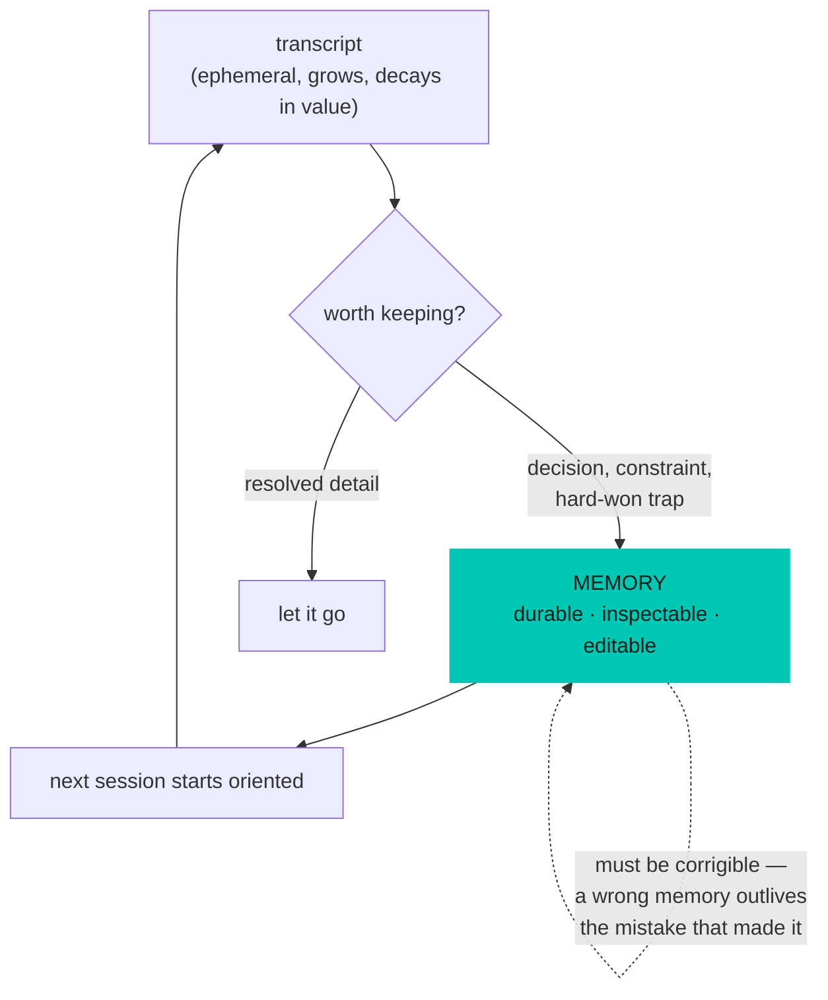

**Participants** — *Transcript* is ephemeral. *Memory* is durable and editable.
*Promotion* decides what crosses. *Correction* keeps memory true.

**Collaborations** — Fed by the receipts of **Plan · Approve · Execute ·
Receipt** (7). Governed by **Honest Gauge** (12): stale memory is a lying
gauge with a long half-life.

**Consequences**
- *Gain*: restarting is normal, which makes upgrades, crashes, and context limits
  non-events.
- *Gain*: the principal can read and correct what the agent believes.
- *Cost*: promotion is a judgement call, and both over- and under-promotion have
  real costs.
- *Trap*: **stale memory is worse than none**, because it is trusted. A memory
  recording a keybinding that has since changed will actively mislead — and
  unlike a transcript, nobody re-reads it looking for errors.
- *Trap*: memory that records *what* without *why*. The reason is the part that
  survives contact with a changed system.

**Implementation** — Promote decisions, constraints, and hard-won traps; let
resolved detail go. Record the *why*, and prefer absolute dates to relative ones.
Make memory a first-class artifact the principal can read, edit, and delete —
not a hidden embedding. Re-verify on read: if a memory names a file, a flag, or a
key, confirm it still exists before acting on it. And when a fact changes,
correct the memory in the same motion as the change, or the next session
inherits the error with full confidence.

**Sample Interaction**

```
CURRENT as of 2026-08-11 ~21:10 (merged 870e197, deployed from the MAIN checkout)

  · Chord is Ctrl+Win. Wispr Flow is DISABLED — that is what freed it.
    Four chords were tried in one day; every move was forced by coexisting
    with Wispr. Removing Wispr solved it in one step.
  · ⚠ --tray is the flag, not --listen. --listen is headless: no icon, no
    overlay, everything else identical. Cost real debugging time.
  · ⚠ Two figures in the change log are suspect, both measured wrong by me.
    555 MB was taken in the wrong mode; real startup is ~1121 MB.

(Chord history — superseded, see CURRENT above: this said Alt+Win because
 Ctrl+Win belonged to Wispr Flow.)
```

**Failure Signature** — Principals refusing to restart a degraded session because
"it knows too much." Or an agent confidently acting on a fact that was true last
month.

**Known Uses** — `CLAUDE.md` and equivalent project files. Claude Code's
`/compact`. Cursor's rules files. ADRs, which are this pattern applied to teams
rather than agents.

**Related Patterns** — **Plan · Approve · Execute · Receipt** (7),
**Honest Gauge** (12), **Capability Disclosure** (1).

---

# Applying the language

## An acceptance checklist

Usable as a review pass on any agent surface. Each line is a pattern stated as a
question the interface must be able to answer.

| # | Question | Pattern |
|---|---|---|
| 1 | Can the principal see what the agent can do and where it stands? | 1 |
| 2 | Is the active mode visible at the moment of use? | 2 |
| 3 | Does output begin before generation completes? | 3 |
| 4 | Can the principal interrupt — and is the scope of the interrupt stated truthfully? | 4 |
| 5 | Does the agent ask only when ambiguity changes the blast radius? | 5 |
| 6 | Are enumerable choices offered as structure rather than prose? | 6 |
| 7 | Is there a plan before action, and a receipt that can differ from it? | 7 |
| 8 | Is every tool call visible with target and result? | 8 |
| 9 | Is state legible without attending to a screen? | 9 |
| 10 | Is consent required, specific, and per-action for irreversible work? | 10 |
| 11 | Does autonomy widen and narrow with demonstrated risk? | 11 |
| 12 | Is every green light honest — and does red mean exactly one thing? | 12 |
| 13 | Does every action have a before-state and a path back? | 13 |
| 14 | Does what matters survive the session, in a form the principal can correct? | 14 |

## Forces that recur

Across the catalogue the same tensions reappear. They are worth naming because
most concrete design arguments are instances of them.

| Force | Pulls toward | Pulls against |
|---|---|---|
| **Attention is finite** | fewer prompts, peripheral channels, collapsed detail | disclosure, transparency, confirmation |
| **Reversibility is purchasable** | investing in undo to buy down ceremony | the irreducible set that cannot be undone |
| **Prose is expressive, structure is precise** | free text for intent | structured objects for selection, review, action |
| **Trust is earned and revocable** | widening autonomy with evidence | automatic descent on surprise |
| **Latency is felt, not measured** | streaming, early partial output | correctness of fragments |
| **Memory decays into lies** | promoting less, correcting eagerly | the cost of re-explanation |

## What this catalogue does not yet cover

Named honestly, because a pattern language that pretends to completeness is its
own dishonest gauge.

- **Multi-agent choreography.** Delegation between agents, and what a receipt
  means when the actor was itself an agent.
- **Long-horizon autonomy.** Work spanning days, where the principal is absent
  for most of it and the transcript is not read at all.
- **Collaborative surfaces.** More than one principal, with different authority,
  against one agent.
- **Failure of the conversational channel itself.** What the agent should do when
  it cannot reach the principal, mid-gate.
- **Evaluation.** None of these have accepted metrics. "Fewer prompts" and
  "better prompts" are not distinguishable without a measure.

---

## Sources and lineage

**Directly ancestral**

- Gamma, Helm, Johnson, Vlissides, *Design Patterns* (1994) — the template, and
  the discipline of stating consequences rather than only benefits.
- Moore, Szymanski, Arar, Ren, *Conversational UX Design: A Practitioner's Guide
  to the Natural Conversation Framework* — the rigorous vocabulary for
  turn-taking, repair, and grounding.
- Shevat, *Designing Bots: Creating Conversational Experiences* — the closest
  existing practical pattern book, and the free-text-versus-controls tradeoff.
- Microsoft Research, *Guidelines for Human-AI Interaction* — 18 guidelines that
  function well as acceptance criteria; "scope services when in doubt" is the
  direct ancestor of pattern 5.
- Google, *Conversation Design* — conversation as an interaction medium.

**Contemporary pattern collections**

- AI UX Playground's pattern catalogue — the broadest current inventory of
  LLM/agent UI conventions.
- Conversation Design Institute's pattern library — production dialog mechanics.
- Smashing Magazine, *Designing Agentic AI: Practical UX Patterns* — the
  suggest → supervise → autonomous continuum behind pattern 11.

**Primary material**

Patterns 2, 3, 9, and 12 are drawn from direct observation on a single
workstation — a voice-first agent surface with a headless resident agent, local
speech-to-text and synthesis, and a physical lighting channel — including the
measurements quoted (11.8 s → first fragment at 1.14 s; the `--tray` / `--listen`
mode failure; the `organon-swap` gauge that reported failure in its healthy
state). Where a number appears in this document, it was measured on that system
rather than estimated.

**A note on what is claimed.** This is a proposed language, not a settled one.
The value of the Gang of Four form is that it makes a design argument *falsifiable*:
each pattern states when it does not apply and what it costs. Patterns that
survive contact with other people's systems are worth keeping; the rest should be
argued out of the catalogue.
